# Continuous X - ML

This project explores the implementation of a Continuous X (CI/CD, Continuous Training and Continuous Monitoring) pipeline for a Machine Learning app. In our example implementation, our model classifies food images into different categories (Bread, Dairy product, Dessert, Egg, Fried food, Meat, Noodles/Pasta, Rice, Seafood, Soup, Vegetable/Fruit).

## 1. Background
### Continuous X Principles
Machine learning operations, or MLOps, is the set of practices in an organization in charge of managing the lifecycle of machine learning models. This includes the automatization of the different tasks that allow for models to adapt to changes in data, business requirements or code. Continuous X or Continuous Machine Learning, CML, specifically ensures that that models are deployed efficiently and that the risks are managed appropriately.

A typical MLOps lifecycle consists of:
1. Machine learning development: experimenting and building a reproducible training pipeling that includes data preparation, training and evaluation.
2. Training operationalization: automating the testing, deployment and packaging of the model pipelines.
3. Continuous training: repeatedly executing the training workflow in response to changes in data, code or scheduled intervals.
4. Model deployment: packaging, testing and deploying models to production environments for experimentation and serving.
5. Prediction serving: serving deployed models in production for real-time inference.
6. Continuous monitoring: tracking the performance and efficiencty of the deployed models.
7. Data and model management: ensuring that the model pipelines are auditable, traceable, compliant and reusable.


__Figure 1__: The MLOps lifecycle [^1]

[^1]: Google Cloud. (n.d.). Practitioner's Guide to MLOps. Google Cloud Whitepaper. [Link](https://services.google.com/fh/files/misc/practitioners_guide_to_mlops_whitepaper.pdf)

Continuous Machine Learning involves different steps, which we will dig into in the following sections. These steps are:
* __Continuous Training__: automating the process of training the model based on changes on business needs, events, or manual requests. Tracking is very important in order to trace datasets, debug, reproduce and manage artifacts and metadata. This step includes data ingestion, data validation, data transformation, model training and tuning, model evaluation, model validation and model registration/versioning.
* __Continuous Integration__: automating the integration of code changes by collaborators in the project, running unit tests, validating the training pipeline in order to ensure compatibility with the rest of the codebase and functionality.
* __Continuous Delivery and Deployment__: packaging and deploying models incrementally. We can manage environments to test in non-production ones to then, gradually expose the model to live traffic before a full production rollout. The strategy will depend on the decisions of the team.
* __Continuous Monitoring__: tracking model performance in production in order to detect issues, such as a data drift (changes in input data) or concept drift (changes in data relationships). Other things to monitor include resource usage, latency, error rates or accuracy, using real-time data. Alerts can be set up prompting updates or retraining.

Figure 2 shows a MLOps process that includes Continuous X in it.

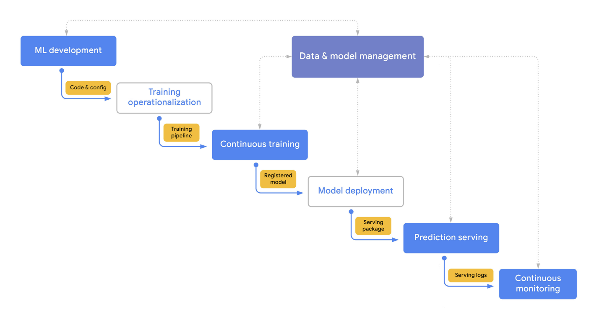

__Figure 2__: The MLOps process [^1]

[^1]: Google Cloud. (n.d.). Practitioner's Guide to MLOps. Google Cloud Whitepaper. [Link](https://services.google.com/fh/files/misc/practitioners_guide_to_mlops_whitepaper.pdf)

Another aspect to keep in mind throughout the next sections is the MLOps principles. All end-to-end pipelines should follow these four key principles:
1. Automation
2. Reusability
3. Reproducibility
4. Manageability


### Continuous Integration
Continuous Integration (CI) is a development strategy that allows for safer and speedier code deployment through frequent code commits. Whenever a commit is made, an automated build and testing workflow will be triggered, allowing for teams to detect and fix issues quickly. This strategy enhances collaboration in a software project.

CI involves the following steps:
* __Commit__: code changes are pushed to the repository.
* __Build__: CI systems automatically build the application with the changes to ensure compatibility.
* __Test__: automated test suite will be run to assess functionality, security and code quality (depending on what the developers set up).
* __Inform__: developers will be given feedback as the tests conclude in order to alert of issues.
* __Integrate__: if successfully passing tests, the changes are merged into the main branch of the code.
* __Deploy__: CI often works with continuous deployment (CI/CD) for automated deployments with the changes.

Specifically, for Machine Learning, code compatibility and quality to check for can include data-handling functions, feature engineering functions or model training/evaluation functions. So this would not involve assessing the model specifically, but ensuring that the code employed to create and manage the model and the inputs and outputs of it are suitable and correct.

When it comes to testing scopes, there are many options, such as, unit tests (to test individual methods and classes), integration (to test pipeline integration points, such as between data processing), functional (to test that business requirements are met), end-to-end, acceptance, performance, smoke (to test that the most critical functions of a program work correctly) or A/B. The speed and granularity needs of the team will ultimately decide which options to implement. Keep in mind that tests should ultimately be robust and not frequently break.

Figure 3 shows a CI workflow that goes from developers committing changes, to building and testing and integrating into the code base.

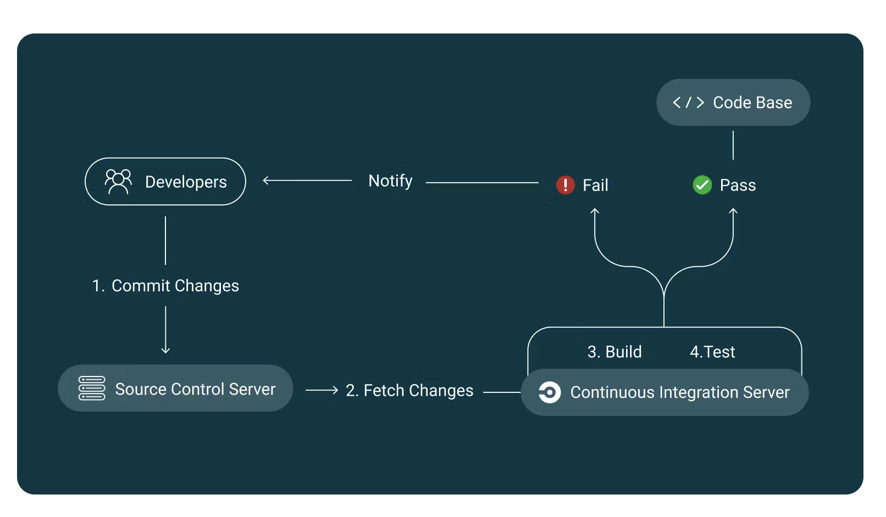

__Figure 3__: The CI process [^2]

[^2]: CircleCI. (n.d.). *Continuous integration*. Retrieved October 8, 2024. [Link](https://circleci.com/continuous-integration/)

#### Containerization
Before introducing containerization, we should understand virtualization. Virtualization creates virtual versions of physical IT resources, such as storage, hardware, or networking, allowing multiple users or environments to share a machine's capacity and resources. There are two main types of virtualization: *Virtual Machines (VMs)* and *Containers*.

Virtual Machines, replicate entire operating systems, while containers bundle applications with their dependencies, sharing the host OS kernel for better efficiency and speed.

Containers facilitate portability by isolating applications from the host system, making it easier to develop once and run anywhere.

Therefore, containerization is a method of packaging an application, along with its dependencies, into a single unit called *container*. This allows the application to consistently run across different environments regardless of the underlying hardware or OS.

* __Docker__

    When speaking of containerization, we must mention Docker. Docker is the most popular technology for containerization. It is an open source tool for building, deploying and managing containerized applications.
    
    In machine learning, Docker becomes very valuable as it isolates environments, ensuring that applications can be ported and reproduced. Docker encapsulates the entire stack down to the host OS, making the setup process smoother, avoiding compatibility issues and promoting consistency across machines, which is particularly beneficial for collaboration in machine learning projects.
    
    Useful terminology:
    * __Dockerfile__: a text file with instructions on how to build the Docker image.
    * __Docker Images__: templates that include the source code, installations and dependencies needed to run a container. They are made up of layers, each one depending on the one below.
    * __Docker Registry__: a repository for storing and sharing Docker images.
    * __Docker Engine__: the core system that manages containerization, which consists of a server, *Docker daemon*, and a client, *Docker CLI*.

### Continuous Delivery and Deployment

>“Continuous Delivery is the ability to get changes of all types — including new features, configuration changes, bug fixes, and experiments — into production, or into the hands of users, safely and quickly in a sustainable way”.
>
>-- Jez Humble and Dave Farley [^3]

[^3]: **Fowler, M.** (2010). *Continuous Delivery: Reliable Software Releases through Build, Test, and Deployment Automation*. Addison-Wesley Professional.

Continuous Delivery consists of automating the end-to-end process of deploying software from version control into production through a reliable and repeatable process, passing all stages of testing, approvals and deployment in different environments.

In the context of machine learning, this is the part of continuous X, where changes are actually deployed, ensuring that new versions of models are continuously tested, integrated and released. This occurs in small and safe increments, commits, allowing for visibility and control. 
The deployment should be able to be delivered into production at any time. CD in machine learning is about a system, ML training pipeline, that should automatically deploy another service (model prediction service) or roll back changes from a model.

Continuous deployment for machine learning include automating the training of models, the collection of metrics and the evaluation of model performance; integrating the automation of data pipelines; automating testing and validation step; and, scaling infrastructure.

Deployment can involve different complex scenarios:
- Multiple models: using different models for the same task, deployed as separate services for easier consumption.
- Shadow models: deploying a new model alongside the old one to compare their performance.
- Competing models: running different model versions to find the best performer.
- Online learning models: models that continuously improve with new data, requiring versioning of both training and production data.

To manage the whole software delivery process, we need orchestration tools, such as Kubernetes (specific to container orchestration). These tools help automate deployment pipelines for building, testing and releasing software to production. In machine learning, this orchestration is needed to handle infrastructure provisioning, training, and evaluating multiple models, and deploying the models to production. These tools can help with rollback processes as well, which can be useful, especially if a model performs poorly in production. Orchestration ensures that all the processes involved in the machine learning life cycle are properly coordinated and executed.

### Continuous Training
This part of continuous X refers to the ongoing process of retraining models with new data or model changes to ensure that they remain accurate and relevant over time. This continuous training involves regularly updating the model in order to adapt to changes in the model's environment. This is especially important because data evolves and models can degrade in performance. The trigger can be a data change, amodel change, a code change or manual.

Over time, a model can become stale due to changes in the real world. Factors such as data drift (change in the production data distribution from the data used for training), concept drift (the connotation behind a target variable has changed from what it was when the model was trained, so a positive result can now mean something different) or both can occur.

There are also different approaches when it comes to what to retrain:
- Continual learning (lifelong training): continuously updates the model as new data becomes available and the adjustments are incremental. The knowledge is retrained. This approach is more vulnerable to concept drift.
- Transfer learning: an existing model is used as a foundation for retraining a new one. It is also incremental. The knowledge is transferred and can train the model on a new task. This approach is more vulnerable to data drift.

Another aspect is to distinguish between *offline learning* and *online learning*.
- Offline learning or batch learning: this is the traditional approach to machine learning. The model is trained on a fixed dataset all at once, and once deployed, learning does not continue. Retraining will involve starting from scratch with updated data.
- Online learning or incremental learning: this involves continuously training the model as new data is introduced. It can adapt as new data flows in. This approach is useful for systems with real-time data and can also be more cost effective, helping prevent data drift.

The whole continuous X process is an ongoing cycle. At the end of deploying and monitoring model performance, we will proceed to retrain in order to ensure that the quality of the model that is in production is up to date.

### Continuous Monitoring
This refers to the ongoing tracking and evaluation of the performance of the machine learning models that are in production to ensure that they continue to perform as expected. Continuous monitoring helps identify issues in production or unexpected changes in system behavior. It focuses on the behavior on the model rather than on software health.

Key things that can be monitored include:
- Model performance, using metrics and logging decisions to choose the best models.
- Data issues and threats, as dynamic feature pipelines and workflows can introduce inconsistencies and errors that can degrade the model's performance.
- Explainability of model decisions.
- Bias, as ML models can amplify biases or introduce new ones, so detecting and addressing them is essential for fairness and reliability.
- Drift in concept or data.

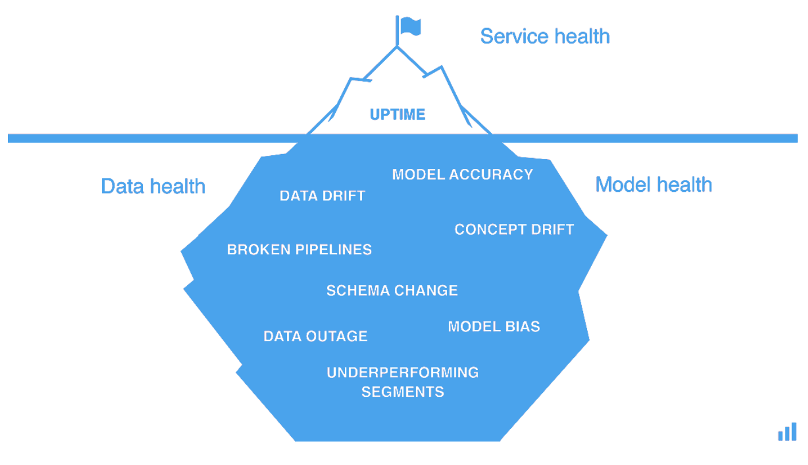

__Figure 4__: ML model health [^4]

[^4]: *MLOps Guide.* Retrieved from [MLOps Guide: Monitoring](https://mlops-guide.github.io/MLOps/Monitoring/#:~:text=Machine%20Learning%20models%20are%20unique,that%20it%20performs%20as%20expected).


The goals of continuous monitoring are:
- Issue detection and alerting.
- Root cause analysis (monitoring should help pinpoint the cause of an issue).
- Machine learning model behavior analysis (we should be able to get insights into the user's behavior and how they interact with the model).
- Action triggers (we can retrain, rollback or reprocess data under certain conditions).
- Performance visibility (monitoring should record metrics for future analysis).
 
There are multiple tools that can help with continuous monitoring, such as Evidently, MLflow or Neptune.

## 2. Implementation
### Overview
The main goal of this project is to build a full pipeline for a machine learning app to continuously train new model modifications, continuously test and evaluate the modified model, and, if certain conditions are met, continuously deploy the accepted model. Additionally, continuous monitoring would also be occurring, which is not in the scope of this project.

In figure 5, we can see an overview of what the implementation of this project looks like. Changes made to the remote repository on GitHub that affect the model (changes in `model_train.py` and `utils.py`) will trigger step 1 in the workflow, `Continuous train`. If successful, we will move on to `continuous test`. Otherwise, we will have to make modifications and trigger the process again. If we pass `continuous test`, we can proceed to `continuous deploy`. Here, we also picture `continuous monitoring`, since it would be the next logical step once the model is in production. However, it is not implemented in this project so it appears in the diagram for illustration purposes.

As we can see on the diagram, training and evaluation occur in the GPU server, which we set up on Chameleon's Jupyter environment, and deployment occurs on node-0, also set up on Chameleon. Therefore, everything is run on our own resources as opposed to GitHub's own resources.

In terms of storage, during training and evaluation, I used Docker volumes to persist model storage across different jobs. The deployment step does not need to store but will need to access the latest accepted model, so we will transfer the resource from the GPU server to node-0.

Deployment occurs on Kubernetes using the Docker image created with the latest model. Kubernetes allows us to orchestrate the containers for the deployment of our app.

We will be able to see the progress and status of our jobs on GitHub Actions.

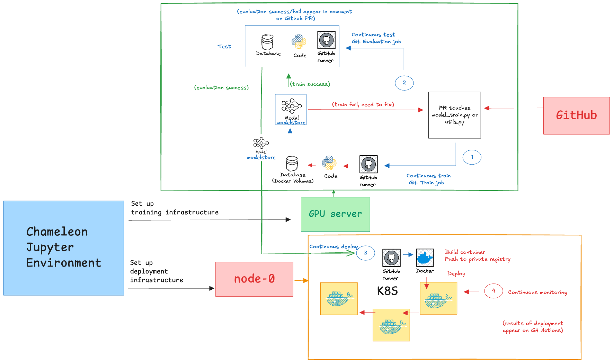

__Figure 5__: Continuous X Project Diagram [^5]

[^5]: Continuous X Project Diagram. Modified from Professor Fraida Fund's original diagram. Retrieved from [Excalidraw](https://app.excalidraw.com/l/2qkLiEmqaLK/2fvXLZ9UaXT).


### Expectations
What is expected to happen with this pipeline is that, if any changes are made to our model and pushed to our remote repository on GitHub, supposing that we collaborate with other teammates on this project, the pipeline will be triggered to retrain with the new changes, then evaluating the model and finally determining whether deployment should happen or not.

The project contains two workflows, which can be seen [here](https://github.com/tin2294/image-classification-continuous-x/actions/workflows/workflow.yml):

1. Deployment Workflow: we will trigger this manually in order to trigger a deployment, for instance, the initial deployment.
2. Continuous X Workflow: this is triggered automatically whenever changes are made to the codebase.

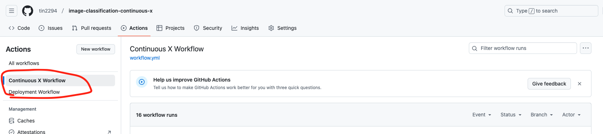

Whenever there is a change in the codebase that is pushed to remote, the following jobs occur:
1. The `train` script will be triggered. This will run the python script for training the model.
2. If training occurs successfully, the `evaluate` script will run.
3. If all tests pass, and conditions are met, finally the model will be deployed and the image is set with the new model, replacing what is already deployed.

Should the model not pass the tests, a redeployment will not occur. What could not passing the tests mean:

1. A job failed, so this does not necessarily have anything to do with the model. GitHub actions will detail the step the job failed on and changes will have to be made and pushed again to rerun the workflow. Note that if the job failed while the container was already started, the container will have to be stopped on the GPU host terminal.

    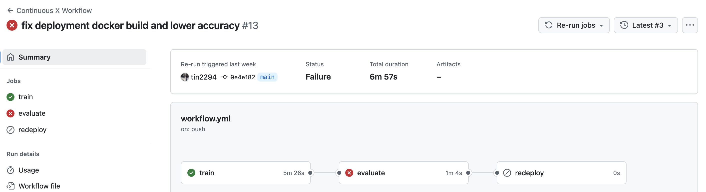

    ```
    # If this occurred during training:
    $ docker stop training_container
    
    # If this occurred during evaluation:
    $ docker stop evaluation_container
    ```

2. The model does not meet the thresholds or conditions set. In this case, we would have to make model changes in order for the model to be acceptable for deployment and push them again.

        #### ADD SCREENSHOT OF MODEL NOT PASSING THRESHOLDS

### Initial Project Setup
1. Run `reserve_chameleon.ipynb`. This notebook will reserve and configure resources on KVM. This sets up host `node-0`. This only needs to be done in the project.
2. Run `Colab_Chameleon_Ubuntu22.ipynb`. This notebook will be run every time we need to create a new lease for resources for our GPU host because our old one expired or because we do not have one. This will be our `GPU` host.
3. SSH GPU host and node-0
    * Open terminal in GPU host via SSH:
        * Open a terminal window within the Jupyter instance (can also be done locally if local public SSH keys are added to authorized_keys in the host) and run (in my case, but it is also printed on `Colab_Chameleon_Ubuntu22.ipynb`):

        ```
        $ ssh cc@192.5.86.227
        ```
    * Generate SSH keys for the host:
    ```
    $ ssh-keygen -t rsa -b 4096 -C "your@email.edu"
    ```
    
    * Now we need to copy the new public key into node-0's authorized keys. This is needed to have access to node-0 to later send our trained and evaluated models to the other host.
        * Manually, in the GPU terminal, we will copy the output of this command:
        ```
        $ cat /home/cc/.ssh/id_rsa.pub
        ```
        On node-0's terminal (we can open a terminal and similar to the GPU host's instructions to log into its terminal, we would run ``` ssh cc@129.114.25.151 ```, changing the address to whichever `reserve_chameleon.ipynb` outputs), we will paste the previous output and save:

        ```
        $ nano .ssh/authorized_keys
        ```
        * Alternatively, we can just run, with the appropriate permissions, from the GPU host's terminal entering the address of node-0:

        ```
        $ ssh-copy-id cc@129.114.25.151
        ```

    These steps should be repeated in the opposite direction, generating a key for `node-0` (this will only occur once for this host when it is first configured for the project) and then copy and paste the public key into the GPU host's authorized keys.
    
    Now, we are ready to send data to node-0 from the GPU host and access its terminal as well.

4. Start runners
Our pipeline is built on GitHub actions, which are triggered upon modifications to the model code and pushes to remote. When this occurs, we want the jobs to be run on the hosts that we have set up on points 1 and 2. In order to do so, we need to have our hosts ready to take the jobs that come from GitHub actions, so they need to be _listening_.
    
    You will need to go [here](https://github.com/tin2294/image-classification-continuous-x/settings/actions/runners) and click on `New self-hosted runner` and select `Linux`:


    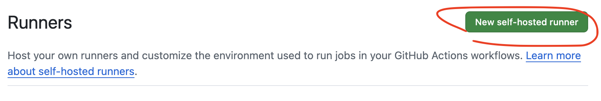


    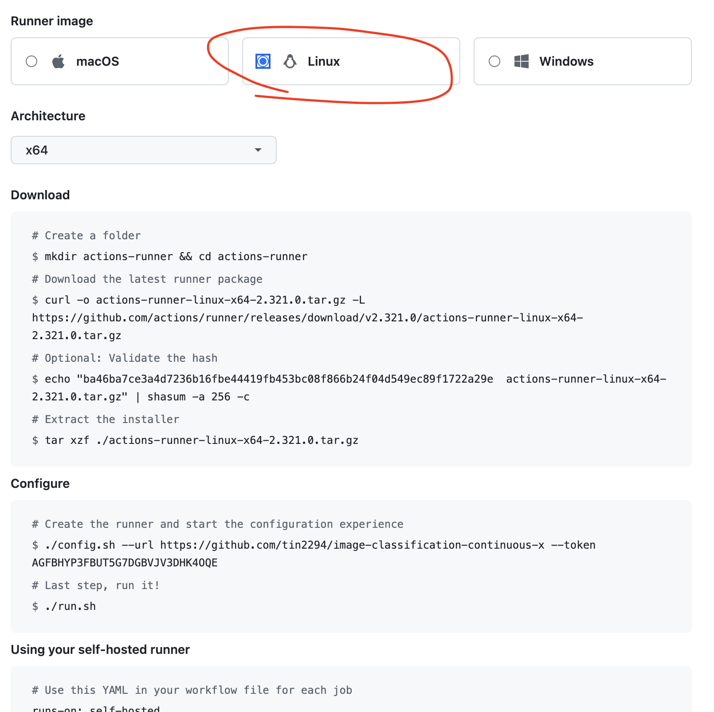
    
    The site will give you the following commands that you will need to run on your GPU and node-0 terminals (your token will be different and each host will have a different runner so this will need to be done once per host):
    
    ```
    # Create a folder
    $ mkdir actions-runner && cd actions-runner
    # Download the latest runner package
    $ curl -o actions-runner-osx-x64-2.321.0.tar.gz -L https://github.com/actions/runner/releases/download/v2.321.0/actions-runner-osx-x64-2.321.0.tar.gz
    # Optional: Validate the hash
    $ echo "b2c91416b3e4d579ae69fc2c381fc50dbda13f1b3fcc283187e2c75d1b173072  actions-runner-osx-x64-2.321.0.tar.gz" | shasum -a 256 -c
    # Extract the installer
    $ tar xzf ./actions-runner-osx-x64-2.321.0.tar.gz
    $ ./config.sh --url https://github.com/tin2294/image-classification-continuous-x --token AGFBHYJYLF2XG2LVC4HGEGLHK4MI6
    # Last step, run it!
    $ ./run.sh
    ```
    NOTE: for `node-0`, this only needs to be done once and for your GPU host, this needs to be done every time we set up resources.
    When we configure the runner, make sure to use the following labels (depending on the host you are configuring the runner for):
    * node-0
    * gpu-p100

        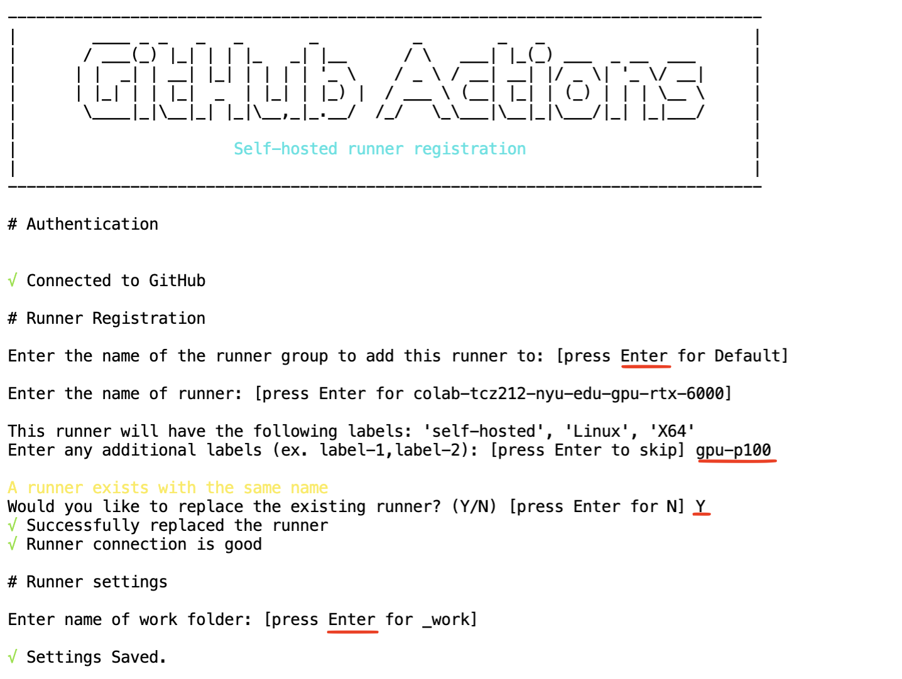

    Now, every time we want to start the runners, on our terminal we need to make sure we are in the `actions-runner` folder and then run `run.sh`:
    
    ```
    $ cd actions-runner
    $ ./run.sh
    ```

5. If this is your first time setting up the project, Docker volumes will need to be created. These volumes are storage that we want persisted across jobs and workflows during out project. The volumes we need on the GPU host are the following:
    1. food11_data (we store the data here)
    2. saved_models (our different model versions are stored using `modelstore` and that storage is here)
    3. model-to-deploy (in this volume, we extract the latest model that we will use for evaluation)
    
    The commands we need to run on the GPU host's terminal:
    
    ```
    $ docker volume create food11_data
    $ docker volume create saved_models
    $ docker volume create model-to-deploy
    ```
    
    You can check that they have been created with (the output should be the names of the volumes we have created):
    
    ```
    $ docker volume ls
    ```


### Initial Deploy and Testing
After the setup, we are ready to deploy. For this step, we will trigger the deployment workflow by going on the [GitHub UI](https://github.com/tin2294/image-classification-continuous-x/actions/workflows/initial_deployment_workflow.yml).

We will click on `Run workflow` and `Run workflow` again.

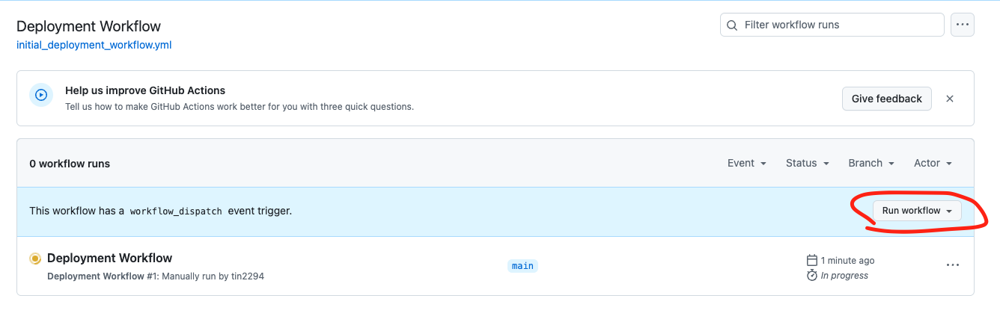

We can track the status of our workflow by clicking into the one just triggered:

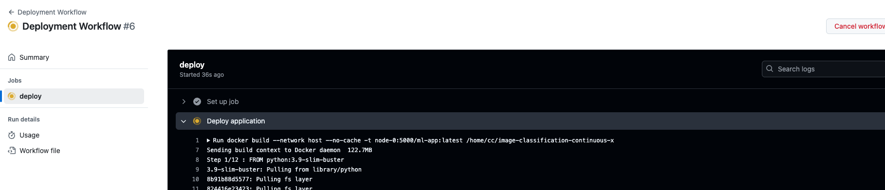

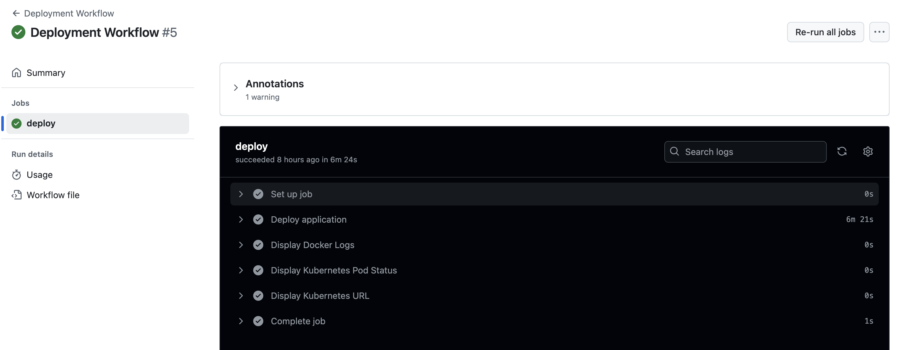


At the end, logs are displayed to show that the deployment was successful and the URL of the application is displayed so we can access it to see the application.

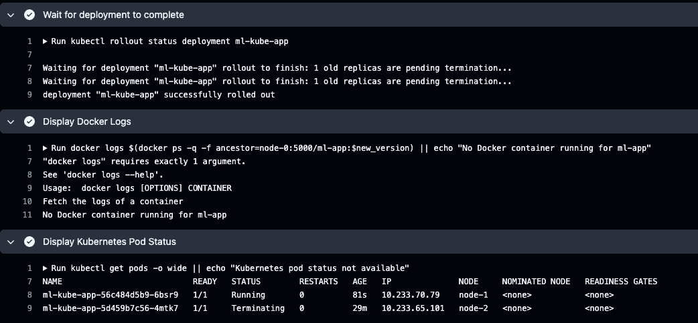

### Continuous X Workflow: Step-by-step walk-through

This script is divided into three jobs: `train`, `evaluate`, and `redeploy`.

#### Train
In this section, we will proceed to train the model in the `model_train.py` script. This is the first job of the workflow.
As we can see on figure 1, this job runs on the self-hosted runner that we created on the GPU host with the tag `gpu-p100`:

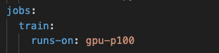

These are the steps that occur in this job:
1. __`Manage Dataset Volume and Download`__:
    * The following command creates the docker container with the name `training_container` with aliases to be used in the codebase for the volumes that exist and are persisted in the GPU host. For instance, we will referring to `food11_data` as `/tmp/content/Food-11` for the volume's directory in the container, and to `saved_models` as `/tmp/temp_models`. We also set our working directory here as `/workspace`. `tensorflow/tensorflow:latest-gpu` uses the official TensorFlow Docker image with its latest version with GPU support. Finally, `tail -f /dev/null` keeps the container running for interactive use.

        ```
          docker run -d --rm --name training_container \
            -v food11_data:/tmp/content/Food-11 \
            -v saved_models:/tmp/temp_models \
            -w /workspace \
            tensorflow/tensorflow:latest-gpu tail -f /dev/null
        ```

    * This command will clone the repository to ensure that we run the remote repository scripts in our Docker container. We do so but executing commands inside of the container through `exec`. If we already have the repository in our working directory, we pull the latest version, and if not, we clone it.
        ```
            docker exec training_container bash -c "
            apt-get update && apt-get install -y git;
            if [ -d 'workspace/src/image-classification-continuous-x' ]; then
              echo 'Repository already exists. Updating...';
              cd /workspace/image-classification-continuous-x && git pull origin main;
            else
              echo 'Cloning repository...';
              git clone https://github.com/tin2294/image-classification-continuous-x.git workspace/src/image-classification-continuous-x;
            fi
          "
        ```

    * Next, we deal with the dataset. Also using `docker exec`, we check whether our volume `food11_data` contains data. If so, we will do nothing, and if not, we will proceed to download the dataset from [here](https://drive.google.com/uc?id=1dt3CD3ICdLbTf80sNJ25TPBDKu_qyCnq). We, then proceed to unzip the compressed file.
        ```
          if docker exec training_container bash -c "[ -d '/tmp/content/Food-11' ] && [ \"\$(ls -A /tmp/content/Food-11)\" ]"; then
            echo "Volume 'food11_data' already contains data. Skipping download."
          else
            echo "Volume 'food11_data' is empty. Downloading dataset."
    
            docker exec training_container bash -c "
              set -e;
              echo 'Downloading and setting up dataset...';
              mkdir -p /tmp/content/Food-11 && \
              apt-get update && \
              pip3 install gdown && \
              gdown https://drive.google.com/uc?id=1dt3CD3ICdLbTf80sNJ25TPBDKu_qyCnq -O /tmp/content/Food-11/dataset.zip && \
              unzip /tmp/content/Food-11/dataset.zip -d /tmp/content/Food-11 && \
              echo 'Dataset downloaded and unzipped. Files included:' && \
              ls -la /tmp/content/Food-11;
            "
          fi
        ```
2. __`Install Dependencies`__: we install the dependencies from the `requirements.txt` in the repository (not to be confused with the `requirements.txt` for the app) in the container:
    ```
    docker exec training_container pip install -r workspace/src/image-classification-continuous-x/requirements.txt
    ```

3. __`Organize Data`__: once everything is installed and the container is ready to operate, we proceed to run the script to organize the dataset into the folder structure needed for data processing in our model training and evaluation. We first check that it is already organized, if so, no organization needs to happen. Otherwise, we organize the data:

    ```
      if docker exec training_container bash -c "[ -d '/tmp/content/Food-11/training/class_00' ]"; then
        echo "Dataset is already organized. Skipping organization step."
      else
        echo "Dataset is not organized. Organizing now..."
        docker exec training_container python workspace/src/image-classification-continuous-x/organize_data.py
      fi
    ```
    We eventually need the following folder structure:
        
        
        /tmp/content/Food-11/
          ├── training/
          │   └── class_00/
          │        └── example.png
          ├── evaluation/
          │   └── class_00/
          │        └── example.png
          ├── validation/
          │   └── class_00/
          │        └── example.png
        ```

4. __`Run Training Script`__: here we finally run our training script `model_train.py` where our model resides:

    ```
    docker exec training_container python workspace/src/image-classification-continuous-x/model_train.py
    ```

5. __`Stop container`__ for our training job:

    ```
    docker stop training_container
    ```

#### Evaluate
In this section, we will evaluate the model that upon successful training on the previous job. Here, we will determine whether this model is acceptable to be deployed or not.

This job also runs on the self-hosted runner that we created on the GPU host with the tag `gpu-p100`:
1. __`Start container`__: this step is very similar to what happens in the `train` job with the exception that we will also be using the volume `model-to-deploy`, which we will refer to as the directory `/tmp/model_to_deploy` where we will be extracting the last model that was trained from the modelstore, since whenever we save a model and it is uploaded in modelstore, they are organized by date.
In this step, we also pull or clone the repository into the new docker container that we have created under the name `eval_container`.

    ```
      docker run -d --rm --name eval_container \
      -v food11_data:/tmp/content/Food-11 \
      -v saved_models:/tmp/temp_models \
      -v model-to-deploy:/tmp/model_to_deploy \
      -w /workspace \
      tensorflow/tensorflow:latest-gpu tail -f /dev/null
    
      docker exec eval_container bash -c "
      apt-get update && apt-get install -y git;
      if [ -d 'workspace/src/image-classification-continuous-x' ]; then
        echo 'Repository already exists. Updating...';
        cd /workspace/image-classification-continuous-x && git pull origin main;
      else
        echo 'Cloning repository...';
        git clone https://github.com/tin2294/image-classification-continuous-x.git workspace/src/image-classification-continuous-x;
      fi
      "
    ```

2. __`Install dependencies`__: just like on the `train` job, we install all the requirements for running scripts in the repository.
3. __`Extract last model`__: here, what we do is bash into the container and run commands to find in the modelstore (`operatorai-model-store/image-classification`) the latest folder, which contains the last model that was trained. We then extract that model, which is compressed, into `/tmp/model_to_deploy`.

    ```
      docker exec eval_container bash -c '
      cd /tmp/temp_models/operatorai-model-store/image-classification/
      latest_dir=$(find "$(ls -d 2024* | grep -v "^versions$" | sort -r | head -n 1)" -type d -print | sort | tail -n 1)
      echo "Latest directory: $latest_dir"
      cd "$latest_dir"
      rm -rf /tmp/model_to_deploy/*
      mkdir -p /tmp/model_to_deploy
      tar -xzf artifacts.tar.gz -C /tmp/model_to_deploy
      '
    ```

4. __`Run evaluate script`__: here we run the evaluation script and write evaluation metrics and create a confusion matrix as well for the last trained model. `/tmp/temp_models/` is the directory of the volume that will contain the confusion matrix and the metrics. In `evaluate_model.py`, we set our thresholds to be met to set the variable `deploy` to `true` or `false`. Based on this variable, we will proceed to redeploy or not.

        #### ADD SCREENSHOTS FROM EVALUATE_MODEL AND SETTING VARIABLE __DEPLOY__
    ```
    docker exec eval_container python workspace/src/image-classification-continuous-x/evaluate_model.py
    ```

5. __`Rsync modelstore from GPU to node-0`__: here, we send the modelstore containing the models from our GPU host to node-0 so that it can be deployed. We use rsync and ssh in order to connect both hosts. This is why it is important in our initial setup to have ssh keys correctly configured on both hosts, in order to be able to connect them. The docker command creates a compressed backup of the `saved_models` volume, where the modelstore and the evaluation metrics were stored and stores it in the GPU host's `/tmp` directory. Then, rsync sends the backup via ssh to node-0's `/tmp/` directory as well.

    ```
      docker run --rm -v saved_models:/volume -v /tmp:/backup busybox tar czf /backup/volume_backup.tar.gz -C /volume .
      rsync -avz -e ssh /tmp/volume_backup.tar.gz cc@129.114.25.151:/tmp/
    ```

6. __`Stop container`__: just like the `train` job but for the `eval_container`.

#### Redeploy
Once training and evaluation have successfully happened and the model is deemed acceptable (`deploy` = true), we will proceed to update the image on Kubernetes with the new model to deploy.

This job runs on node-0 as can be seen here:

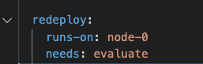

The steps of this job are the following:
1. __`Set up Python`__: this step takes care of installing Python.
2. __`Extract model store`__: this step extracts the contents of the backup sent on rsync from the GPU host to node-0. The extraction goes on the directory `/extracted`.

    ```
      cd /tmp
      tar -xzf volume_backup.tar.gz -C ~/extracted
    ```

3. __`Extract last model`__: here, we will, similarly to job `evaluate`, extract the latest model from the modelstore that we extracted on `/extracted` as received from the GPU host. We will also extract this model to a directory in the root of node-0: `/model-to-deploy`.

    ```
      cd ~/extracted/operatorai-model-store/image-classification/
      latest_dir=$(find "$(ls -d 2024* | grep -v '^versions$' | sort -r | head -n 1)" -type d -print | sort | tail -n 1)
      echo "Latest directory: $latest_dir"
      cd "$latest_dir"
      rm -rf ~/model-to-deploy/*
      tar -xzf artifacts.tar.gz -C ~/model-to-deploy
    ```

4. __`Copy model to ml-app directory (/home/cc/k8s-ml/app/model.keras)`__: n ow that we have the model we want to deploy, in order to do so, we have to place it into our app directory. Our app is in the home directory inside of: `/k8s-ml/app/`. We want to replace the `model.keras` file in that folder. We do that this way:

    ```
      ls -ld /home/cc/k8s-ml/app/
      cp ~/model-to-deploy/*.keras ~/k8s-ml/app/model.keras
    ```

5. __`Build and push Docker image`__: in this step, we proceed to `build` the new image following the specifications on the Dockerfile inside of `~/k8s-ml/app/`. Note that there is a new `requirements.txt` file here that is different from the one in the main directory of the repository. This image is built in the local Docker and we will `push` it to the remote registry `node-0:5000/ml-app:$new_version`. `$new_version` results from getting the last image name and the part of the string that specifies the version and adding one. Therefore, we can maintain the versions dynamic.

    ```
      current_version=$(kubectl get deployment ml-kube-app -o=jsonpath='{.spec.template.spec.containers[?(@.name=="ml-kube-app")].image}' | awk -F: '{print $NF}')
      new_version=$(echo $current_version | awk -F. '{printf "%d.%d.%d", $1, $2, $3+1}')
      echo "Building and pushing image for version: $new_version"
      docker build --network host --no-cache -t node-0:5000/ml-app:$new_version /home/cc/k8s-ml/app
      docker push node-0:5000/ml-app:$new_version
    ```

6. __`Cleanup unused Docker resources`__: this step cleans up unused Docker resources.

    ```
    docker system prune -f || echo "Docker cleanup failed"
    ```

7. __`Set new docker image with the last model`__: this step updates the image used in the Kubernetes deployment. From an initial or previous deployment, there will be an image that is applied to the deployment. Since we have built a new image based on the new model, we want to apply this new image to the deployment `ml-kube-app`. We also want to update the version, which is why we compute it here too.

    ```
      current_version=$(kubectl get deployment ml-kube-app -o=jsonpath='{.spec.template.spec.containers[?(@.name=="ml-kube-app")].image}' | awk -F: '{print $NF}')
      new_version=$(echo $current_version | awk -F. '{printf "%d.%d.%d", $1, $2, $3+1}')
      echo "Setting image for version: $new_version"
      kubectl set image deployment ml-kube-app ml-kube-app=node-0:5000/ml-app:$new_version
    ```

8. __`Wait for deployment to complete`__: once we set the image successfully, we want to make sure that the old Kubernetes pod is successfully terminated and the new one is running. This step waits for this handoff to occur before succeeding and moving on to the next step.

    ```
    kubectl rollout status deployment ml-kube-app
    ```

9. __`Display Kubernetes Pod Status`__: this step prints the status of the pods, which ideally will show one running and one terminating.

    ```
    kubectl get pods -o wide || echo "Kubernetes pod status not available"
    ```

10. __`Display Kubernetes URL`__: this step simply prints the Kubernetes URL where we can see our app deployed for convenience.

    ```
    echo http://$(curl -s ifconfig.me/ip):32000
    ```


### Continuous X Workflow Demo
When we make any changes to `model_train.py` or `utils.py`, which are the files that are directly related to our model, on our codebase and push them to the remote repository on the `main` branch, the `Continuous X Workflow` will be triggered automatically.

#### Successful Run:

Eventually, what we want to achieve is, at the very least, this screen:

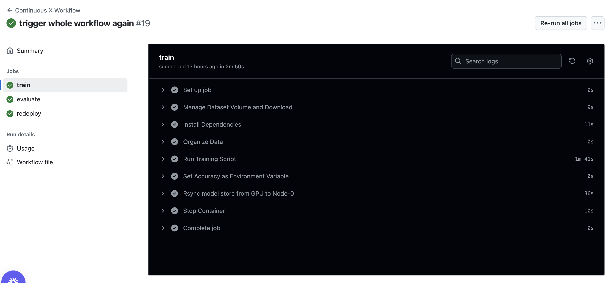


When we make a change in the code that triggers the continuous x workflow, the runner on the GPU host will be listening and will pick up the first job `train`.

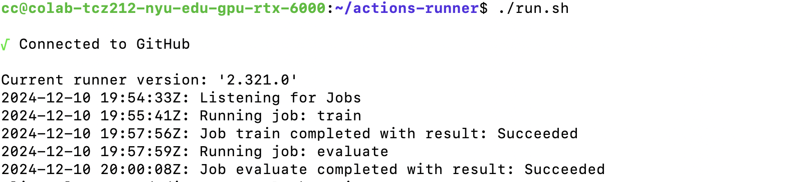

The steps on `train` will start running sequentially until they are all successful. The training script will print results such as:

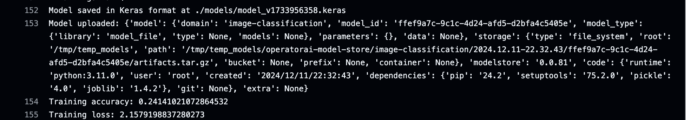

Once that happens, the workflow will move on to the `evaluate` job. The runner on the GPU host will also pick up this job and run it.

This job will run and produce evaluation metrics and a confusion matrix that we can find saved in our volumes in the host.


For instance, the evaluation_metrics.txt:

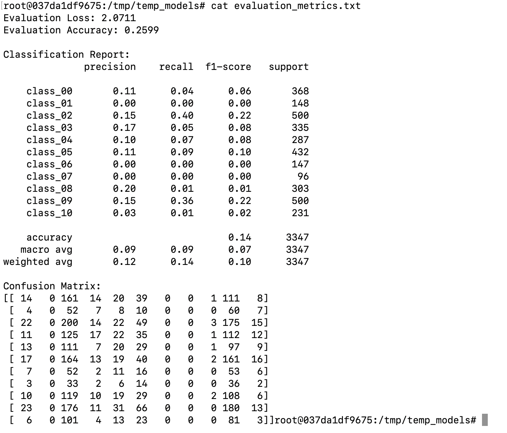


If the `evalute` job concludes successfully and we pass the accuracy threshold. The `redeploy` job will be triggered. Once successfully redeployed, we can see the hand off from the old container to the new one.


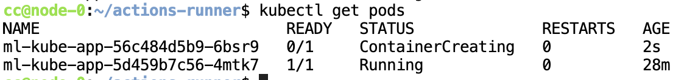

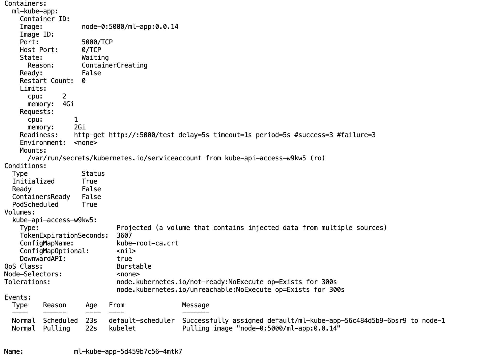

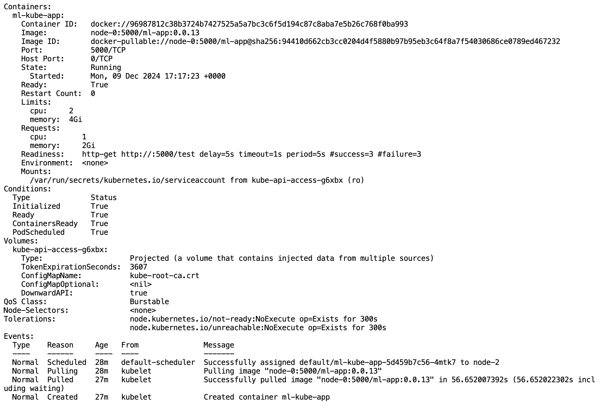

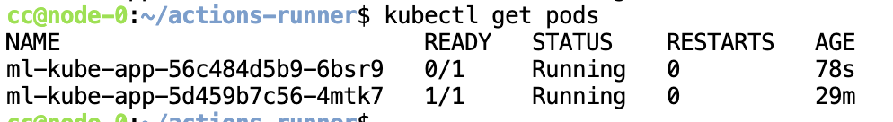


#### Unsuccessful Run:
An unsuccessful run can occur due to a couple of reasons: a step in the workflow failed or the model accuracy threshold was not met.

1. Step in workflow failed:

    When this happens, we will see, when we enter the specific job on GitHub actions exactly the step it occurs at so that we can pinpoint the issue and fix it. In our example, in the `redeploy` job we can see that the `Build and push Docker image` step fails and the reason why. Now, I can go back to node-0 and clear up some space so that I can re-run this failed job or the whole workflow. We can retrigger this manually on the same page where we see the logs.

    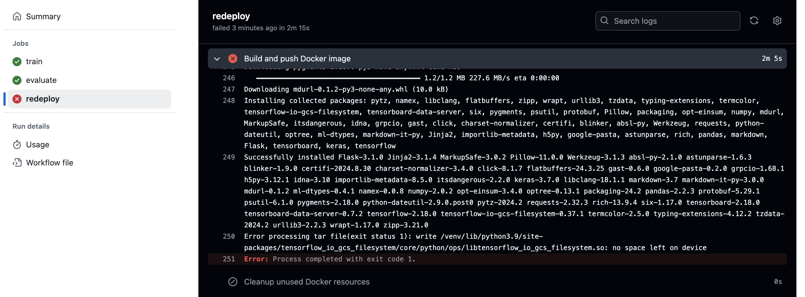

2. The model is not acceptable:

    When this occurs, the jobs do not fail. Simply, redeploy will not occur because the accuracy threshold set in `evaluate_model.py` was not met. In this case, we will have to go back and improve our model and push those changes to remote in order to have the whole workflow run again and deploy this new model.

    If accuracy falls below the threshold, the `redeploy` job will be skipped (I set the threshold high for this example to make `deploy='false'`:

    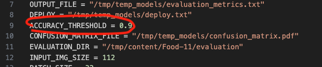

    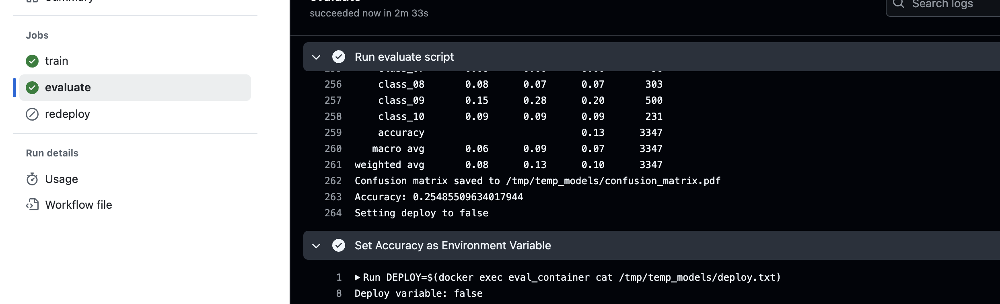

    If accuracy passes the threshold, the redeploy job is triggered (set the threshold low):

    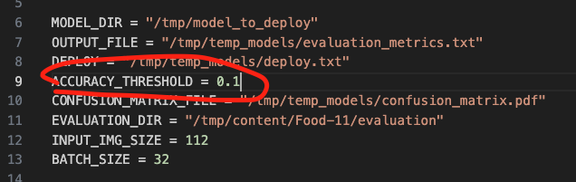

    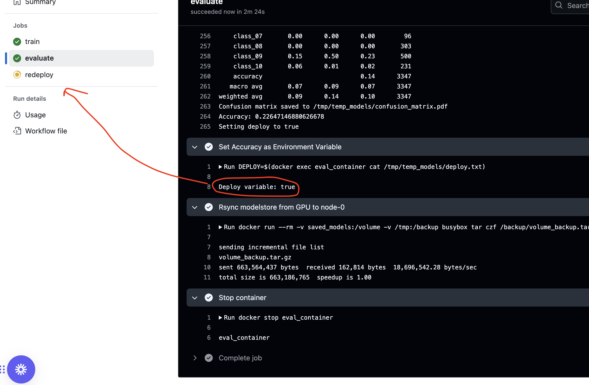


## 3. Future Improvements
* Add more tests

    Right now, a basic working pipeline is set up for the model. However, we ideally want to watch out for more metrics other than accuracy, such as loss, bias, data drift or concept drift.
* Add continuous monitoring

    We are currently missing the last step in continuous X, which is monitoring. We want to monitor the performance of our deployed model and set up alerts to retrain or rollback.

* Refactor and optimize some of the actions

    Some of the steps could be optimized and reorganized in order to avoid unncessary computations.

* Take advantage of live data

    Ideally, we would want to continue learning from the data that the user inputs in the application when entering images to classify.

* For the purposes of creating this pipeline and since the focus is not on training the model, its current performance is very low. So I would also like to improve the model.

## Troubleshooting

* If runners fail to pick up a job and the terminal freezes and we can no longer exit it we can run:
    ```
    ps aux | grep actions-runner
    ```

    And then, we would kill the `action-runners` processes:
    ```
    kill <id>
    ```
* If `train` or `evaluate` fail without the docker container stopping, we have to kill them for the next run to proceed:
    ```
    // training_container or eval_container
    docker stop training_container
    ```

## References

1. **TaskUs**. *Continuous Machine Learning: Insights from TaskUs*.  
   Retrieved from [https://www.taskus.com/insights/continuous-machine-learning/](https://www.taskus.com/insights/continuous-machine-learning/)

2. **Google Cloud**. *Practitioner's Guide to MLOps*. Google Cloud Whitepaper.  
   Retrieved from [https://services.google.com/fh/files/misc/practitioners_guide_to_mlops_whitepaper.pdf](https://services.google.com/fh/files/misc/practitioners_guide_to_mlops_whitepaper.pdf)

3. **MathWorks**. *What is MLOps?*  
   Retrieved from [https://www.mathworks.com/videos/what-is-mlops-1706066104525.html](https://www.mathworks.com/videos/what-is-mlops-1706066104525.html)

4. **Yan, E.** (2022, January 10). *Writing robust tests for data & machine learning pipelines*. Eugene Yan.  
   Retrieved from [https://eugeneyan.com/writing/testing-pipelines/](https://eugeneyan.com/writing/testing-pipelines/)

5. **CircleCI**. *Continuous integration*.  
   Retrieved October 8, 2024, from [https://circleci.com/continuous-integration/](https://circleci.com/continuous-integration/)

6. **Comet**. *Containerization of Machine Learning Applications*.  
   Retrieved October 8, 2024, from [https://www.comet.com/site/blog/containerization-of-machine-learning-applications/](https://www.comet.com/site/blog/containerization-of-machine-learning-applications/)

7. **Fowler, M.** *Continuous Delivery for Machine Learning*.  
   Retrieved from [https://martinfowler.com/articles/cd4ml.html](https://martinfowler.com/articles/cd4ml.html)

8. **Hegde, R.** (2021, March 9). *MLOps, Continuous Delivery, and Automation Pipelines in Machine Learning*. Medium.  
   Retrieved from [https://medium.com/@rajuhegde2006/mlops-continuous-delivery-and-automation-pipelines-in-machine-learning-093cd6e09fb3](https://medium.com/@rajuhegde2006/mlops-continuous-delivery-and-automation-pipelines-in-machine-learning-093cd6e09fb3)

9. **Evidently AI**. *Model Monitoring in Production*.  
   Retrieved from [https://www.evidentlyai.com/ml-in-production/model-monitoring](https://www.evidentlyai.com/ml-in-production/model-monitoring)

10. **MLOps Guide**. *Monitoring Machine Learning Models*.  
    Retrieved from [https://mlops-guide.github.io/MLOps/Monitoring/#:~:text=Machine%20Learning%20models%20are%20unique,that%20it%20performs%20as%20expected.](https://mlops-guide.github.io/MLOps/Monitoring/#:~:text=Machine%20Learning%20models%20are%20unique,that%20it%20performs%20as%20expected.)

11. **Neptune.ai**. *Retraining Models During Deployment: Continuous Training and Continuous Testing*.  
    Retrieved from [https://neptune.ai/blog/retraining-model-during-deployment-continuous-training-continuous-testing](https://neptune.ai/blog/retraining-model-during-deployment-continuous-training-continuous-testing)
