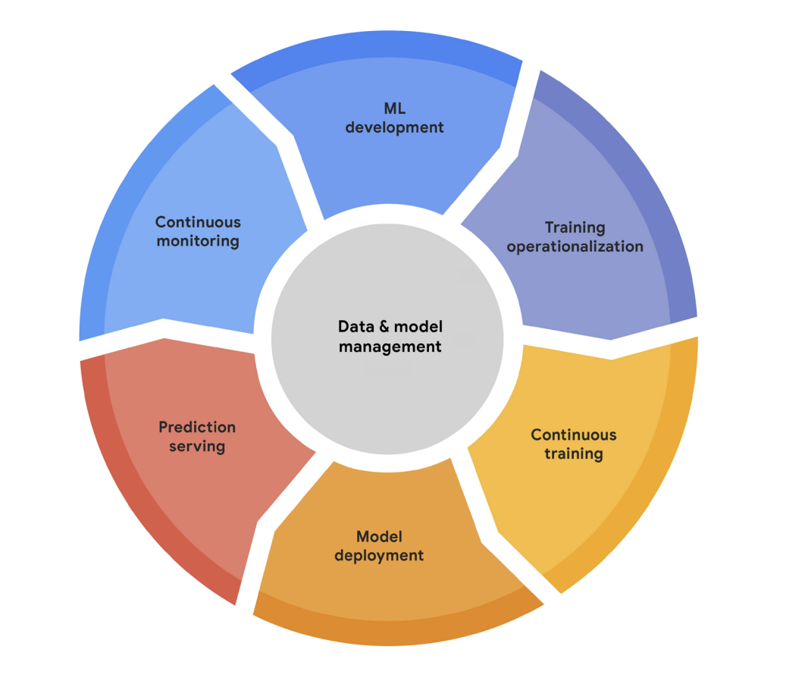

# Continuous X - ML

This project explores the building of a Continuous X (CI/CD, Continuous Training and Continuous Monitoring) pipeline for a Machine Learning app.

## 1. Background
### Continuous X Principles
Machine learning operations, or MLOps, is the set of practices in an organization in charge of managing the lifecycle of machine learning models. This includes the automatization of the different tasks that allow for models to adapt to changes in data, business requirements or code. Continuous X or Continuous Machine Learning, CML, specifically ensures that that models are deployed efficiently and that the risks are managed appropriately.

A typical MLOps lifecycle, which can be seen on figure 1, consists of:
1. Machine learning development: experimenting and building a reproducible training pipeling that includes data preparation, training and evaluation.
2. Training operationalization: automating the testing, deployment and packaging of the model pipelines.
3. Continuous training: repeatedly executing the training workflow in response to changes in data, code or scheduled intervals.
4. Model deployment: packaging, testing and deploying models to production environments for experimentation and serving.
5. Prediction serving: serving deployed models in production for real-time inference.
6. Continuous monitoring: tracking the performance and efficiencty of the deployed models.
7. Data and model management: ensuring that the model pipelines are auditable, traceable, compliant and reusable.


**Figure 1**: The MLOps lifecycle[^1]

[^1]: Google Cloud. (n.d.). Practitioner's Guide to MLOps. Google Cloud Whitepaper. [Link](https://services.google.com/fh/files/misc/practitioners_guide_to_mlops_whitepaper.pdf)

### Continuous Integration
#### Containerization
### Continuous Delivery and Deployment
### Continuous Training
### Continuous Monitoring

## 2. Implementation
### Overview
The main goal of this project is to build a full pipeline for a machine learning app to continuously train new model modifications, continuously test and evaluate the modified model, and, if certain conditions are met, continuously deploy the accepted model. Additionally, continuous monitoring would also be occurring, which is not in the scope of this project.

        #### ADD SCREENSHOTS OF DIAGRAM
        #### Explain storage and Docker and Kubernetes

### Expectations
What is expected to happen with this pipeline is that, if any changes are made to our model and pushed to our remote repository on GitHub, supposing that we collaborate with other teammates on this project, the pipeline will be triggered to retrain with the new changes, then evaluating the model and finally determining whether deployment should happen or not.

The project contains two workflows, which can be seen [here](https://github.com/tin2294/image-classification-continuous-x/actions/workflows/workflow.yml):

1. Deployment Workflow: we will trigger this manually in order to trigger a deployment, for instance, the initial deployment.
2. Continuous X Workflow: this is triggered automatically whenever changes are made to the codebase.

        #### ADD SCREENSHOT OF GITHUB WITH WORKFLOWS

Whenever there is a change in the codebase that is pushed to remote, the following jobs occur:
1. The `train` script will be triggered. This will run the python script for training the model.
2. If training occurs successfully, the `evaluate` script will run.
3. If all tests pass, and conditions are met, finally the model will be deployed and the image is set with the new model, replacing what is already deployed.

Should the model not pass the tests, a redeployment will not occur. What could not passing the tests mean:

1. A job failed, so this does not necessarily have anything to do with the model. GitHub actions will detail the step the job failed on and changes will have to be made and pushed again to rerun the workflow. Note that if the job failed while the container was already started, the container will have to be stopped on the GPU host terminal.

    ```
    # If this occurred during training:
    $ docker stop training_container

    # If this occurred during evaluation:
    $ docker stop evaluation_container
    ```

        #### ADD SCREENSHOT OF FAILED JOB

2. The model does not meet the thresholds or conditions set. In this case, we would have to make model changes in order for the model to be acceptable for deployment and push them again.

        #### ADD SCREENSHOT OF MODEL NOT PASSING THRESHOLDS

### Initial Project Setup
1. Run `reserve_chameleon.ipynb`. This notebook will reserve and configure resources on KVM. This sets up host `node-0`. This only needs to be done in the project.
2. Run `Colab_Chameleon_Ubuntu22.ipynb`. This notebook will be run every time we need to create a new lease for resources for our GPU host because our old one expired or because we do not have one. This will be our `GPU` host.
3. SSH GPU host and node-0
    * Open terminal in GPU host via SSH:
        * Open a terminal window within the Jupyter instance (can also be done locally if local public SSH keys are added to authorized_keys in the host) and run (in my case, but it is also printed on `Colab_Chameleon_Ubuntu22.ipynb`):

        ```
        $ ssh cc@192.5.86.227
        ```
    * Generate SSH keys for the host:
    ```
    $ ssh-keygen -t rsa -b 4096 -C "your@email.edu"
    ```
    
    * Now we need to copy the new public key into node-0's authorized keys. This is needed to have access to node-0 to later send our trained and evaluated models to the other host.
        * Manually, in the GPU terminal, we will copy the output of this command:
        ```
        $ cat /home/cc/.ssh/id_rsa.pub
        ```
        On node-0's terminal (we can open a terminal and similar to the GPU host's instructions to log into its terminal, we would run ``` ssh cc@129.114.25.151 ```, changing the address to whichever `reserve_chameleon.ipynb` outputs), we will paste the previous output and save:

        ```
        $ nano .ssh/authorized_keys
        ```
        * Alternatively, we can just run, with the appropriate permissions, from the GPU host's terminal entering the address of node-0:

        ```
        $ ssh-copy-id cc@129.114.25.151
        ```

    These steps should be repeated in the opposite direction, generating a key for `node-0` (this will only occur once for this host when it is first configured for the project) and then copy and paste the public key into the GPU host's authorized keys.
    
    Now, we are ready to send data to node-0 from the GPU host and access its terminal as well.

4. Start runners
Our pipeline is built on GitHub actions, which are triggered upon modifications to the model code and pushes to remote. When this occurs, we want the jobs to be run on the hosts that we have set up on points 1 and 2. In order to do so, we need to have our hosts ready to take the jobs that come from GitHub actions, so they need to be _listening_.
    
    You will need to go [here](https://github.com/tin2294/image-classification-continuous-x/settings/actions/runners) and click on `New self-hosted runner` and select `Linux`:
    
            #### ADD SCREENSHOTS
    
    The site will give you the following commands that tou will need to run on your GPU and node-0 terminals (your token will be different and each host will have a different runner so this will need to be done once per host):
    
    ```
    # Create a folder
    $ mkdir actions-runner && cd actions-runner
    # Download the latest runner package
    $ curl -o actions-runner-osx-x64-2.321.0.tar.gz -L https://github.com/actions/runner/releases/download/v2.321.0/actions-runner-osx-x64-2.321.0.tar.gz
    # Optional: Validate the hash
    $ echo "b2c91416b3e4d579ae69fc2c381fc50dbda13f1b3fcc283187e2c75d1b173072  actions-runner-osx-x64-2.321.0.tar.gz" | shasum -a 256 -c
    # Extract the installer
    $ tar xzf ./actions-runner-osx-x64-2.321.0.tar.gz
    $ ./config.sh --url https://github.com/tin2294/image-classification-continuous-x --token AGFBHYJYLF2XG2LVC4HGEGLHK4MI6
    # Last step, run it!
    $ ./run.sh
    ```
    NOTE: for `node-0`, this only needs to be done once and for your GPU host, this needs to be done every time we set up resources.
    When we configure the runner, make sure to use the following labels (depending on the host you are configuring the runner for):
    * node-0
    * gpu-p100

            #### ADD SCREENSHOTS

    Now, every time we want to start the runners, on our terminal we need to make sure we are in the `actions-runner` folder and then run `run.sh`:
    
    ```
    $ cd actions-runner
    $ ./run.sh
    ```

5. If this is your first time setting up the project, Docker volumes will need to be created. These volumes are storage that we want persisted across jobs and workflows during out project. The volumes we need on the GPU host are the following:
    1. food11_data (we store the data here)
    2. saved_models (our different model versions are stored using `modelstore` and that storage is here)
    3. model-to-deploy (in this volume, we extract the latest model that we will use for evaluation)
    
    The commands we need to run on the GPU host's terminal:
    
    ```
    $ docker volume create food11_data
    $ docker volume create saved_models
    $ docker volume create model-to-deploy
    ```
    
    You can check that they have been created with (the output should be the names of the volumes we have created):
    
    ```
    $ docker volume ls
    ```


### Initial Deploy and Testing
After the setup, we are ready to deploy. For this step, we will trigger the deployment workflow by going on the [GitHub UI](https://github.com/tin2294/image-classification-continuous-x/actions/workflows/initial_deployment_workflow.yml).

We will click on `Run workflow` and `Run workflow` again.

        ### ADD SCREENSHOT OF BUTTON

We can track the status of our workflow by clicking into the one just triggered:

        ### ADD SCREENSHOT OF SUCCESSFUL DEPLOY
        ### ADD SCREENSHOT OF WORFKLOW RUNNING

At the end, logs are displayed to show that the deployment was successful and the URL of the application is displayed so we can access it to see the application.

        ### ADD SCREENSHOT OF END OF FILE SUCCESSFULLY RUN

### Continuous X Workflow: Step-by-step walk-through

This script is divided into three jobs: `train`, `evaluate`, and `redeploy`.

#### Train
In this section, we will proceed to train the model in the `model_train.py` script. This is the first job of the workflow.
As we can see on figure 1, this job runs on the self-hosted runner that we created on the GPU host with the tag `gpu-p100`:

        #### ADD SCREENSHOT OF GPU TAG

These are the steps that occur in this job:
1. __`Manage Dataset Volume and Download`__:
    * The following command creates the docker container with the name `training_container` with aliases to be used in the codebase for the volumes that exist and are persisted in the GPU host. For instance, we will referring to `food11_data` as `/tmp/content/Food-11` for the volume's directory in the container, and to `saved_models` as `/tmp/temp_models`. We also set our working directory here as `/workspace`. `tensorflow/tensorflow:latest-gpu` uses the official TensorFlow Docker image with its latest version with GPU support. Finally, `tail -f /dev/null` keeps the container running for interactive use.

        ```
          docker run -d --rm --name training_container \
            -v food11_data:/tmp/content/Food-11 \
            -v saved_models:/tmp/temp_models \
            -w /workspace \
            tensorflow/tensorflow:latest-gpu tail -f /dev/null
        ```

    * This command will clone the repository to ensure that we run the remote repository scripts in our Docker container. We do so but executing commands inside of the container through `exec`. If we already have the repository in our working directory, we pull the latest version, and if not, we clone it.
        ```
            docker exec training_container bash -c "
            apt-get update && apt-get install -y git;
            if [ -d 'workspace/src/image-classification-continuous-x' ]; then
              echo 'Repository already exists. Updating...';
              cd /workspace/image-classification-continuous-x && git pull origin main;
            else
              echo 'Cloning repository...';
              git clone https://github.com/tin2294/image-classification-continuous-x.git workspace/src/image-classification-continuous-x;
            fi
          "
        ```

    * Next, we deal with the dataset. Also using `docker exec`, we check whether our volume `food11_data` contains data. If so, we will do nothing, and if not, we will proceed to download the dataset from [here](https://drive.google.com/uc?id=1dt3CD3ICdLbTf80sNJ25TPBDKu_qyCnq). We, then proceed to unzip the compressed file.
        ```
          if docker exec training_container bash -c "[ -d '/tmp/content/Food-11' ] && [ \"\$(ls -A /tmp/content/Food-11)\" ]"; then
            echo "Volume 'food11_data' already contains data. Skipping download."
          else
            echo "Volume 'food11_data' is empty. Downloading dataset."
    
            docker exec training_container bash -c "
              set -e;
              echo 'Downloading and setting up dataset...';
              mkdir -p /tmp/content/Food-11 && \
              apt-get update && \
              pip3 install gdown && \
              gdown https://drive.google.com/uc?id=1dt3CD3ICdLbTf80sNJ25TPBDKu_qyCnq -O /tmp/content/Food-11/dataset.zip && \
              unzip /tmp/content/Food-11/dataset.zip -d /tmp/content/Food-11 && \
              echo 'Dataset downloaded and unzipped. Files included:' && \
              ls -la /tmp/content/Food-11;
            "
          fi
        ```
2. __`Install Dependencies`__: we install the dependencies from the `requirements.txt` in the repository (not to be confused with the `requirements.txt` for the app) in the container:
    ```
    docker exec training_container pip install -r workspace/src/image-classification-continuous-x/requirements.txt
    ```

3. __`Organize Data`__: once everything is installed and the container is ready to operate, we proceed to run the script to organize the dataset into the folder structure needed for data processing in our model training and evaluation. We first check that it is already organized, if so, no organization needs to happen. Otherwise, we organize the data:

    ```
      if docker exec training_container bash -c "[ -d '/tmp/content/Food-11/training/class_00' ]"; then
        echo "Dataset is already organized. Skipping organization step."
      else
        echo "Dataset is not organized. Organizing now..."
        docker exec training_container python workspace/src/image-classification-continuous-x/organize_data.py
      fi
    ```
    We eventually need the following folder structure:
        
        
        /tmp/content/Food-11/
          ├── training/
          │   └── class_00/
          │        └── example.png
          ├── evaluation/
          │   └── class_00/
          │        └── example.png
          ├── validation/
          │   └── class_00/
          │        └── example.png
        ```

4. __`Run Training Script`__: here we finally run our training script `model_train.py` where our model resides:

    ```
    docker exec training_container python workspace/src/image-classification-continuous-x/model_train.py
    ```

5. __`Stop container`__ for our training job:

    ```
    docker stop training_container
    ```

#### Evaluate
In this section, we will evaluate the model that upon successful training on the previous job. Here, we will determine whether this model is acceptable to be deployed or not.

This job also runs on the self-hosted runner that we created on the GPU host with the tag `gpu-p100`:
1. __`Start container`__: this step is very similar to what happens in the `train` job with the exception that we will also be using the volume `model-to-deploy`, which we will refer to as the directory `/tmp/model_to_deploy` where we will be extracting the last model that was trained from the modelstore, since whenever we save a model and it is uploaded in modelstore, they are organized by date.
In this step, we also pull or clone the repository into the new docker container that we have created under the name `eval_container`.

    ```
      docker run -d --rm --name eval_container \
      -v food11_data:/tmp/content/Food-11 \
      -v saved_models:/tmp/temp_models \
      -v model-to-deploy:/tmp/model_to_deploy \
      -w /workspace \
      tensorflow/tensorflow:latest-gpu tail -f /dev/null
    
      docker exec eval_container bash -c "
      apt-get update && apt-get install -y git;
      if [ -d 'workspace/src/image-classification-continuous-x' ]; then
        echo 'Repository already exists. Updating...';
        cd /workspace/image-classification-continuous-x && git pull origin main;
      else
        echo 'Cloning repository...';
        git clone https://github.com/tin2294/image-classification-continuous-x.git workspace/src/image-classification-continuous-x;
      fi
      "
    ```

2. __`Install dependencies`__: just like on the `train` job, we install all the requirements for running scripts in the repository.
3. __`Extract last model`__: here, what we do is bash into the container and run commands to find in the modelstore (`operatorai-model-store/image-classification`) the latest folder, which contains the last model that was trained. We then extract that model, which is compressed, into `/tmp/model_to_deploy`.

    ```
      docker exec eval_container bash -c '
      cd /tmp/temp_models/operatorai-model-store/image-classification/
      latest_dir=$(find "$(ls -d 2024* | grep -v "^versions$" | sort -r | head -n 1)" -type d -print | sort | tail -n 1)
      echo "Latest directory: $latest_dir"
      cd "$latest_dir"
      rm -rf /tmp/model_to_deploy/*
      mkdir -p /tmp/model_to_deploy
      tar -xzf artifacts.tar.gz -C /tmp/model_to_deploy
      '
    ```

4. __`Run evaluate script`__: here we run the evaluation script and write evaluation metrics and create a confusion matrix as well for the last trained model. `/tmp/temp_models/` is the directory of the volume that will contain the confusion matrix and the metrics. In `evaluate_model.py`, we set our thresholds to be met to set the variable `deploy` to `true` or `false`. Based on this variable, we will proceed to redeploy or not.

        #### ADD SCREENSHOTS FROM EVALUATE_MODEL AND SETTING VARIABLE __DEPLOY__
    ```
    docker exec eval_container python workspace/src/image-classification-continuous-x/evaluate_model.py
    ```

5. __`Rsync modelstore from GPU to node-0`__: here, we send the modelstore containing the models from our GPU host to node-0 so that it can be deployed. We use rsync and ssh in order to connect both hosts. This is why it is important in our initial setup to have ssh keys correctly configured on both hosts, in order to be able to connect them. The docker command creates a compressed backup of the `saved_models` volume, where the modelstore and the evaluation metrics were stored and stores it in the GPU host's `/tmp` directory. Then, rsync sends the backup via ssh to node-0's `/tmp/` directory as well.

    ```
      docker run --rm -v saved_models:/volume -v /tmp:/backup busybox tar czf /backup/volume_backup.tar.gz -C /volume .
      rsync -avz -e ssh /tmp/volume_backup.tar.gz cc@129.114.25.151:/tmp/
    ```

6. __`Stop container`__: just like the `train` job but for the `eval_container`.

#### Redeploy
Once training and evaluation have successfully happened and the model is deemed acceptable (`deploy` = true), we will proceed to update the image on Kubernetes with the new model to deploy.

This job runs on node-0 as can be seen here:

        #### ADD SCREENSHOT OF node-0

The steps of this job are the following:
1. __`Set up Python`__: this step takes care of installing Python.
2. __`Extract model store`__: this step extracts the contents of the backup sent on rsync from the GPU host to node-0. The extraction goes on the directory `/extracted`.

    ```
      cd /tmp
      tar -xzf volume_backup.tar.gz -C ~/extracted
    ```

3. __`Extract last model`__: here, we will, similarly to job `evaluate`, extract the latest model from the modelstore that we extracted on `/extracted` as received from the GPU host. We will also extract this model to a directory in the root of node-0: `/model-to-deploy`.

    ```
      cd ~/extracted/operatorai-model-store/image-classification/
      latest_dir=$(find "$(ls -d 2024* | grep -v '^versions$' | sort -r | head -n 1)" -type d -print | sort | tail -n 1)
      echo "Latest directory: $latest_dir"
      cd "$latest_dir"
      rm -rf ~/model-to-deploy/*
      tar -xzf artifacts.tar.gz -C ~/model-to-deploy
    ```

4. __`Copy model to ml-app directory (/home/cc/k8s-ml/app/model.keras)`__: n ow that we have the model we want to deploy, in order to do so, we have to place it into our app directory. Our app is in the home directory inside of: `/k8s-ml/app/`. We want to replace the `model.keras` file in that folder. We do that this way:

    ```
      ls -ld /home/cc/k8s-ml/app/
      cp ~/model-to-deploy/*.keras ~/k8s-ml/app/model.keras
    ```

5. __`Build and push Docker image`__: in this step, we proceed to `build` the new image following the specifications on the Dockerfile inside of `~/k8s-ml/app/`. Note that there is a new `requirements.txt` file here that is different from the one in the main directory of the repository. This image is built in the local Docker and we will `push` it to the remote registry `node-0:5000/ml-app:$new_version`. `$new_version` results from getting the last image name and the part of the string that specifies the version and adding one. Therefore, we can maintain the versions dynamic.

    ```
      current_version=$(kubectl get deployment ml-kube-app -o=jsonpath='{.spec.template.spec.containers[?(@.name=="ml-kube-app")].image}' | awk -F: '{print $NF}')
      new_version=$(echo $current_version | awk -F. '{printf "%d.%d.%d", $1, $2, $3+1}')
      echo "Building and pushing image for version: $new_version"
      docker build --network host --no-cache -t node-0:5000/ml-app:$new_version /home/cc/k8s-ml/app
      docker push node-0:5000/ml-app:$new_version
    ```

6. __`Cleanup unused Docker resources`__: this step cleans up unused Docker resources.

    ```
    docker system prune -f || echo "Docker cleanup failed"
    ```

7. __`Set new docker image with the last model`__: this step updates the image used in the Kubernetes deployment. From an initial or previous deployment, there will be an image that is applied to the deployment. Since we have built a new image based on the new model, we want to apply this new image to the deployment `ml-kube-app`. We also want to update the version, which is why we compute it here too.

    ```
      current_version=$(kubectl get deployment ml-kube-app -o=jsonpath='{.spec.template.spec.containers[?(@.name=="ml-kube-app")].image}' | awk -F: '{print $NF}')
      new_version=$(echo $current_version | awk -F. '{printf "%d.%d.%d", $1, $2, $3+1}')
      echo "Setting image for version: $new_version"
      kubectl set image deployment ml-kube-app ml-kube-app=node-0:5000/ml-app:$new_version
    ```

8. __`Wait for deployment to complete`__: once we set the image successfully, we want to make sure that the old Kubernetes pod is successfully terminated and the new one is running. This step waits for this handoff to occur before succeeding and moving on to the next step.

    ```
    kubectl rollout status deployment ml-kube-app
    ```

9. __`Display Kubernetes Pod Status`__: this step prints the status of the pods, which ideally will show one running and one terminating.

    ```
    kubectl get pods -o wide || echo "Kubernetes pod status not available"
    ```

10. __`Display Kubernetes URL`__: this step simply prints the Kubernetes URL where we can see our app deployed for convenience.

    ```
    echo http://$(curl -s ifconfig.me/ip):32000
    ```


### Continuous X Workflow Demo
When we make any changes to `model_train.py` or `utils.py`, which are the files that are directly related to our model, on our codebase and push them to the remote repository on the `main` branch, the `Continuous X Workflow` will be triggered automatically.

#### Successful Run:

Eventually, what we want to achieve is, at the very least, this screen:

        #### ADD CONT X WORKFLOW SUCCESS SCREENSHOT

        #### ADD CONFUSION MATRIX SCREENSHOT AND EVALUATION METRICS


#### Unsuccessful Run:

## 3. Future Improvements
* Continuous monitoring
* Add more tests
* Set up alerts
* Item 2a
* Item 2b
    * Item 3a
    * Item 3b

## Troubleshooting:
* Stop containers when jobs fail
* Restart runners when they fail + command to kill the runners when they freeze on the terminal
    ```
    ps aux | grep actions-runner
    ```

## 4. Sources
